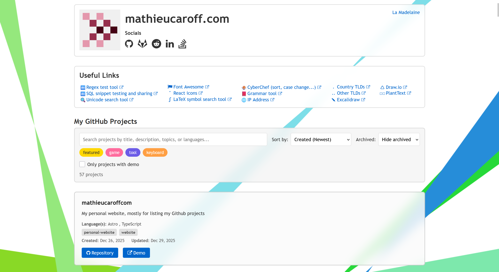

# GitHub Projects Showcase

A minimal showcase website for GitHub projects built with Astro.



## Features

- **Build-time data fetching**: Pulls all public repositories from GitHub API during build
- **Search & Filter**: Search by title, description, topics, or languages
- **Sorting**: Sort by creation date or last update date (ascending/descending)
- **Hash Navigation**: Link to specific projects using URL fragments
- **Responsive Design**: Works on all device sizes

## Development

```bash
# Install dependencies
bun install

# Start dev server
bun run dev

# Build for production
bun run build

# Preview production build
bun run preview
```

## Deployment

Build the static site and deploy the `dist/` directory to your server:

```bash
bun run build
# Upload contents of dist/ to your Ubuntu VPS
```
